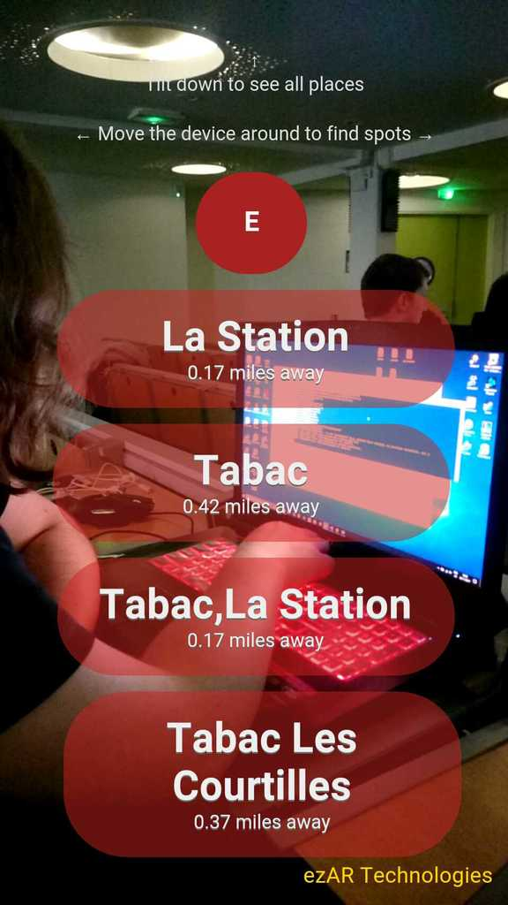

# HoloSmoke
> Application de recherche de bureaux de tabac en réalité augmentée .

[![NPM Version][npm-image]][npm-url]
[![Downloads Stats][npm-downloads]][npm-url]




## Installation

OS X 
```sh
cordova platform add ios 
cordova run ios
```

Android:

```sh
cordova run android
```

## Utilisation

Ouvret l'application et profitez trouver le bureau de tabac le plus proche.


## Development setup

Réalisé avec Cordova 7.1.0.

```sh
npm install -g cordova
```

## Release History

* 0.1.1
    * FIX: Problème de refresh
* 0.1.0
    * Récuperation et affichage des points de tabac
* 0.0.1
    * Implémentation

## Meta

Nabil Abbach – [@NabilAbbach](https://twitter.com/dbader_org) – nabil.abbach@epitech.eu
Olivier laffon - [@iLLoDev](https://twitter.com/dbader_org) - olivier.laffon@epitech.eu
Aymeric Gand - aymeric.gand@epitech.eu


## Contributing

1. Fork it (<https://github.com/yourname/yourproject/fork>)
2. Create your feature branch (`git checkout -b feature/fooBar`)
3. Commit your changes (`git commit -am 'Add some fooBar'`)
4. Push to the branch (`git push origin feature/fooBar`)
5. Create a new Pull Request

<!-- Markdown link & img dfn's -->
[npm-image]: https://img.shields.io/npm/v/cordova.svg?style=flat-square
[npm-url]: https://www.npmjs.com/package/cordova
[npm-downloads]: https://img.shields.io/npm/dm/cordova.svg?style=flat-square
[wiki]: https://github.com/yourname/yourproject/wiki
